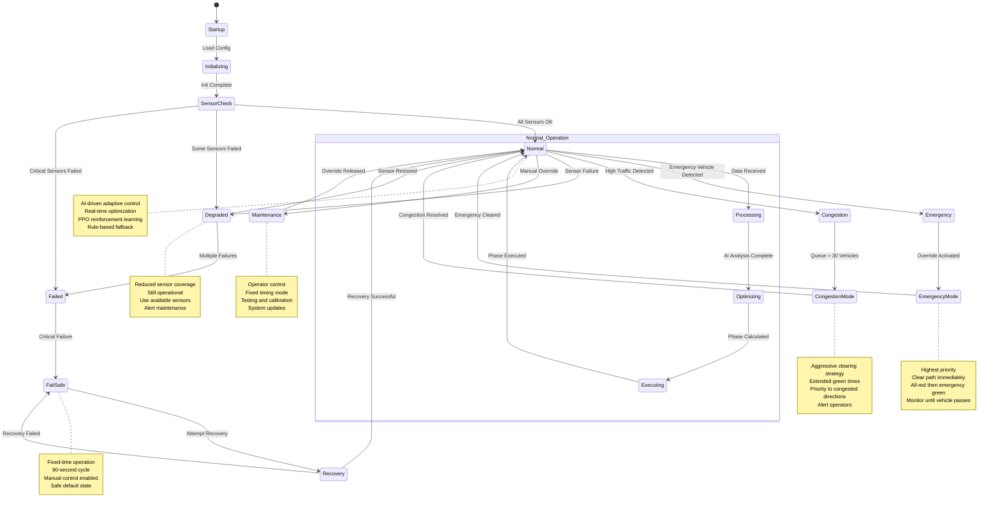
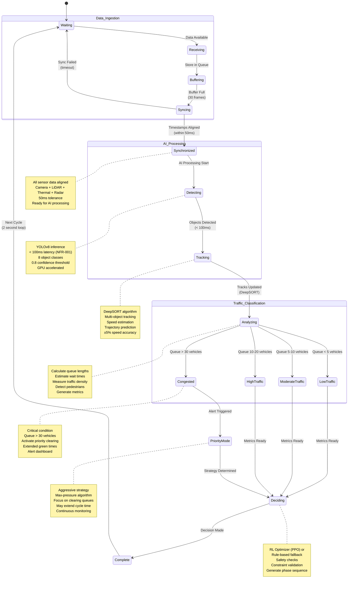
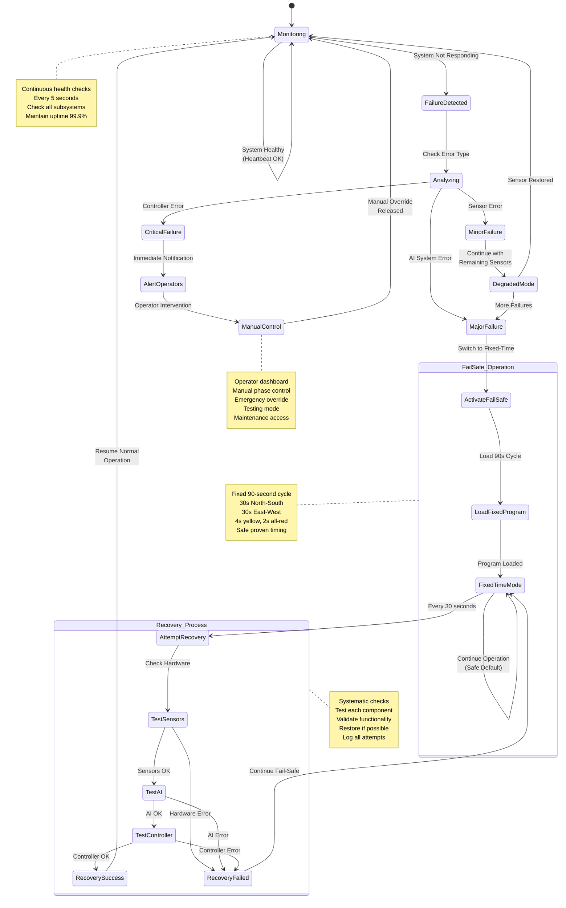
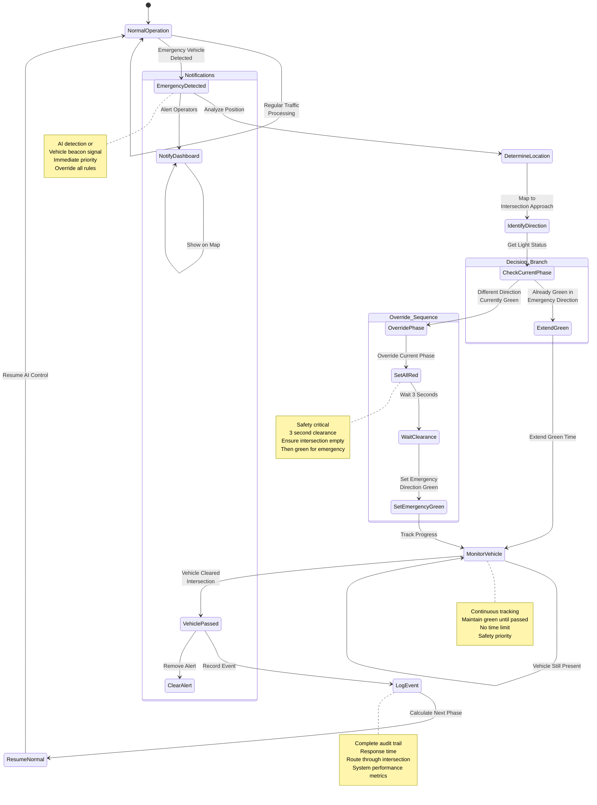

# ATMS State Diagrams - Complete Specifications
**Date:** October 1, 2025  
**Format:** Mermaid Diagrams (Ready to Export to PNG)

---

## State Diagram 1: Traffic Light State Machine

### Overview
This diagram shows all possible states of a traffic light and the transitions between them, including normal operation and fail-safe modes.

### States:
- **Initialization:** System starting up
- **Red:** Vehicles must stop
- **Green:** Vehicles may proceed
- **Yellow:** Prepare to stop (4 seconds)
- **AllRed:** All directions red (2-3 second clearance)
- **FlashingYellow:** Fail-safe mode (proceed with caution)
- **FlashingRed:** Fail-safe mode (treat as stop sign)

### Mermaid Code:

```mermaid
stateDiagram-v2
    [*] --> Initialization
    
    Initialization --> Red: System Start
    
    state Normal_Operation {
        Red --> Green: Phase Change Command
        Green --> Yellow: Timer Expired<br/>(10-120 seconds)
        Yellow --> Red: Timer Expired<br/>(4 seconds)
    }
    
    Red --> AllRed: Emergency Override
    Green --> AllRed: Emergency Override
    Yellow --> AllRed: Emergency Override
    
    AllRed --> Green: Emergency Cleared<br/>(after 2-3s clearance)
    
    state Fail_Safe_Mode {
        Green --> FlashingYellow: Fail-Safe Activated
        Red --> FlashingRed: Fail-Safe Activated
        Yellow --> FlashingRed: Fail-Safe Activated
        
        FlashingYellow --> FlashingYellow: Continue Flashing
        FlashingRed --> FlashingRed: Continue Flashing
    }
    
    FlashingYellow --> Green: System Restored
    FlashingRed --> Red: System Restored
    
    note right of Green
        Duration: 10-120 seconds
        AI-determined based on traffic
        Minimum: 10s (safety)
        Maximum: 120s (fairness)
    end note
    
    note right of Yellow
        Duration: 4 seconds (fixed)
        Safety standard for stopping
        Not adjustable
    end note
    
    note right of AllRed
        Duration: 2-3 seconds
        Clearance interval
        Ensures intersection is clear
        Required for safety
    end note
    
    note right of FlashingYellow
        Proceed with caution
        No fixed cycle
        Until system restored
    end note
    
    note right of FlashingRed
        Treat as stop sign
        Fail-safe default
        Manual control enabled
    end note
```

---

## State Diagram 2: System Operational States

### Overview
This diagram shows the complete operational state machine of the ATMS system, including startup, normal operation, emergency modes, degraded operation, and fail-safe recovery.

### States:
- **Startup → Initializing → SensorCheck:** System initialization sequence
- **Normal:** AI-driven adaptive traffic control (primary state)
- **Processing → Optimizing → Executing:** Normal operation sub-states
- **Emergency → EmergencyMode:** Emergency vehicle handling
- **Congestion → CongestionMode:** Heavy traffic management
- **Degraded:** Some sensors failed but system operational
- **Failed:** Critical failure detected
- **FailSafe:** Fixed-time operation mode
- **Recovery:** Attempting to restore normal operation
- **Maintenance:** Manual override by operator

### Mermaid Code:



---

## State Diagram 3: Data Processing State

### Overview
This diagram shows how sensor data flows through the system, from reception to decision-making, including all traffic condition states and processing stages.

### States:
- **Waiting:** Idle, ready for data
- **Receiving → Buffering:** Data ingestion
- **Syncing → Synchronized:** Timestamp alignment
- **Detecting → Tracking → Analyzing:** AI processing pipeline
- **LowTraffic/ModerateTraffic/HighTraffic/Congested:** Traffic condition states
- **PriorityMode:** Special handling for congestion
- **Deciding → Complete:** Decision output

### Mermaid Code:



---

## State Diagram 4: Fail-Safe System States (Bonus)

### Overview
Detailed state machine for the fail-safe subsystem, showing how the system detects failures and recovers.

### Mermaid Code:



---

## State Diagram 5: Emergency Vehicle Priority States (Bonus)

### Overview
Specialized state machine showing the emergency vehicle detection and priority handling process.

### Mermaid Code:



---

## Export Instructions

### How to Create PNG Images:

#### Method 1: Using Mermaid Live Editor
1. Go to https://mermaid.live/
2. Copy the mermaid code (including ```mermaid tags)
3. Paste into the editor
4. Click "Export" → "PNG"
5. Save with appropriate filename

#### Method 2: Using mermaid-cli
```bash
# Install mermaid-cli
npm install -g @mermaid-js/mermaid-cli

# Convert to PNG
mmdc -i STATE_DIAGRAMS.md -o "Traffic Light State Machine.png" -t default -b transparent

# Or convert all at once
mmdc -i STATE_DIAGRAMS.md -o state_diagrams.png
```

#### Method 3: Using VS Code
1. Install "Markdown Preview Mermaid Support" extension
2. Open this file
3. Right-click on diagram in preview
4. Select "Export to PNG"

### Recommended Filenames:
1. `Traffic Light State Machine.png`
2. `System Operational States.png`
3. `Data Processing State.png`
4. `Fail-Safe System States.png` (bonus)
5. `Emergency Vehicle Priority States.png` (bonus)

---

## Validation Checklist

After creating the PNG images, verify each diagram has:

### ✅ Traffic Light State Machine
- [ ] 7 states (Init, Red, Green, Yellow, AllRed, FlashingYellow, FlashingRed)
- [ ] Initial state indicator (●)
- [ ] Normal operation cycle (Red → Green → Yellow → Red)
- [ ] Emergency transitions (All states → AllRed)
- [ ] Fail-safe transitions (All → Flashing states)
- [ ] Return to normal transitions
- [ ] Timing notes (Green: 10-120s, Yellow: 4s, AllRed: 2-3s)

### ✅ System Operational States
- [ ] 16 states showing full system lifecycle
- [ ] Startup sequence (Startup → Init → SensorCheck)
- [ ] Normal operation loop
- [ ] Emergency handling path
- [ ] Congestion handling path
- [ ] Degraded operation path
- [ ] Fail-safe activation and recovery
- [ ] Maintenance mode
- [ ] Notes explaining each major state

### ✅ Data Processing State
- [ ] 15 states from data ingestion to decision
- [ ] Data ingestion flow (Waiting → Receiving → Buffering)
- [ ] Synchronization process
- [ ] AI processing pipeline (Detecting → Tracking → Analyzing)
- [ ] Traffic classification (Low/Moderate/High/Congested)
- [ ] Priority mode for congestion
- [ ] Decision and completion
- [ ] Loop back to waiting
- [ ] Timing and performance notes

### ✅ Fail-Safe System States (if included)
- [ ] Monitoring → Failure detection → Analysis
- [ ] Failure classification (Minor/Major/Critical)
- [ ] Degraded mode operation
- [ ] Fail-safe activation
- [ ] Fixed-time program
- [ ] Recovery attempts
- [ ] Manual control option

### ✅ Emergency Priority States (if included)
- [ ] Detection → Location → Direction
- [ ] Current phase check
- [ ] Override sequence (All-red → Emergency green)
- [ ] Vehicle monitoring
- [ ] Event logging
- [ ] Resume normal operation
- [ ] Dashboard notifications

---

## Integration with Other Diagrams

### Related Diagrams:
- **Sequence Diagram:** "Emergency Vehicle Detection" shows the same process in time sequence
- **Sequence Diagram:** "System Failure & Recovery" matches the Fail-Safe states
- **Class Diagram:** "Traffic Controller Classes" implements these state machines
- **Activity Diagram:** Shows the activities within each state

### Cross-References:
- State "Normal Operation" = Class "TrafficOptimizer.optimize_loop()"
- State "Detecting" = Class "ObjectDetector.detect_objects()"
- State "FailSafe" = Class "FailSafeSystem.activate()"
- State "EmergencyMode" = Class "EmergencyHandler.handle_emergency()"

---

## Technical Notes

### State Machine Implementation:
In code (Implementation.md), these states are implemented as:
- Enums for state values
- State pattern design
- Event-driven transitions
- Guard conditions in if/else blocks
- Entry/exit actions as methods

### Example Code Mapping:
```python
# State enum
class SystemState(Enum):
    STARTUP = "startup"
    NORMAL = "normal"
    EMERGENCY = "emergency"
    FAILED = "failed"
    FAILSAFE = "failsafe"

# State machine
class ATMSStateMachine:
    def __init__(self):
        self.current_state = SystemState.STARTUP
    
    def transition(self, event):
        # Implement transitions from diagrams
        pass
```

---

**Document Complete**  
**Ready for PNG Export**  
**All 5 State Diagrams Included**

Place exported PNG files in: `/Users/kappasutra/Traffic/UML/State_Diagrams/`

